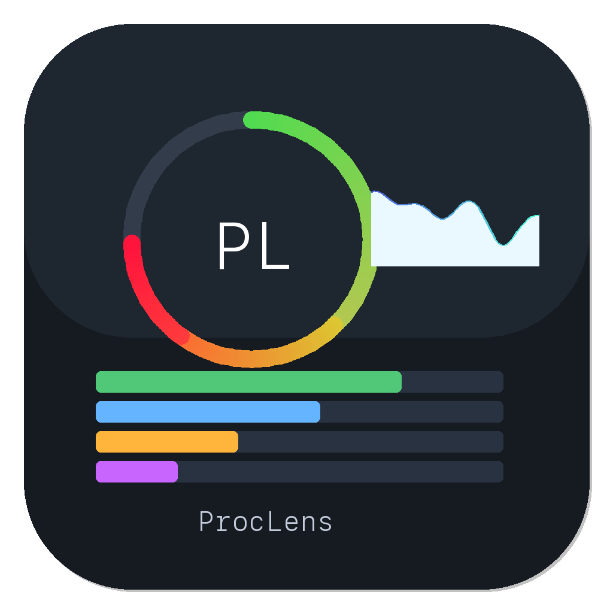

<p align="center">
  
</p>

<h1 align="center">ProcLens</h1>

<p align="center">
  <strong>macOS Process Monitor</strong> — inspired by Process Hacker
</p>

<p align="center">
  
  
  
  
</p>

---

Native SwiftUI app for real-time process monitoring on macOS. View, search, sort, suspend, kill, and inspect every process running on your Mac.

## Features

| Feature | Description |
|---------|-------------|
| **Process List** | Sortable table — PID, Name, CPU%, Memory, User, Threads, Status |
| **Sparkline Graphs** | Real-time CPU history per process, inline in the table |
| **Process Tree** | Toggle between flat list and parent-child hierarchy |
| **Inspector Panel** | Tabbed detail view: Info, Network, Files, Environment |
| **Network Connections** | Per-process TCP/UDP connections and listening ports |
| **Open Files** | All file descriptors with search filter |
| **Environment Variables** | Full env dump per process with search |
| **Suspend / Resume** | SIGSTOP / SIGCONT from toolbar or right-click menu |
| **Kill Process** | SIGTERM or SIGKILL with confirmation dialog |
| **Priority Control** | Adjust nice value with a slider |
| **Export CSV** | Export full process list to CSV |
| **Dark / Light Theme** | System, Light, or Dark — switchable from menu bar |
| **Real App Icons** | Displays actual application icons from the system |
| **Search** | Filter processes by name, PID, user, or path |

## Install

### Download

Grab the latest DMG from [Releases](https://github.com/NonBytes/ProcLens/releases/latest), open it, and drag **ProcLens** to **Applications**.

### Build from source

Requires Xcode 16+ and [xcodegen](https://github.com/yonaskolb/XcodeGen).

```bash
git clone https://github.com/NonBytes/ProcLens.git
cd ProcLens
xcodegen generate
open ProcLens.xcodeproj
```

Build and run with `⌘R`.

## Keyboard Shortcuts

| Shortcut | Action |
|----------|--------|
| `⌘R` | Refresh process list |
| `⌘E` | Export to CSV |
| `⌫` | Terminate selected process |

## Requirements

- macOS 14.0 (Sonoma) or later
- Apple Silicon or Intel Mac (Universal Binary)

## Architecture

```
ProcLens/
├── App/              # App entry point, settings, theme
├── Models/           # ProcessItem, DetailModels (network, files, tree)
├── Services/         # ProcessManager, SystemMonitor, HistoryTracker,
│                     # ProcessDetails, IconProvider
├── Views/            # ContentView, ProcessListView, ProcessTreeView,
│                     # ProcessDetailView, SystemStatsView, SparklineView,
│                     # DetailTabsView (Network/Files/Env tabs)
├── Bridge/           # C bridging for disk I/O
└── Assets.xcassets/  # App icon
```

## Tech Stack

- **SwiftUI** + **@Observable** (macOS 14 Observation framework)
- **Darwin APIs** — `sysctl`, `proc_pidinfo`, `proc_listallpids`, `host_processor_info`
- **lsof** — network connections and open files (on-demand)
- **KERN_PROCARGS2** — environment variable extraction

## License

MIT
